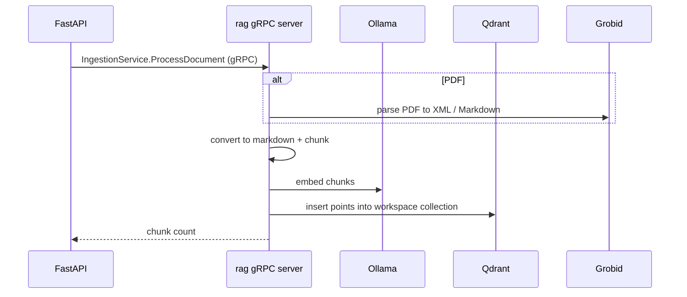
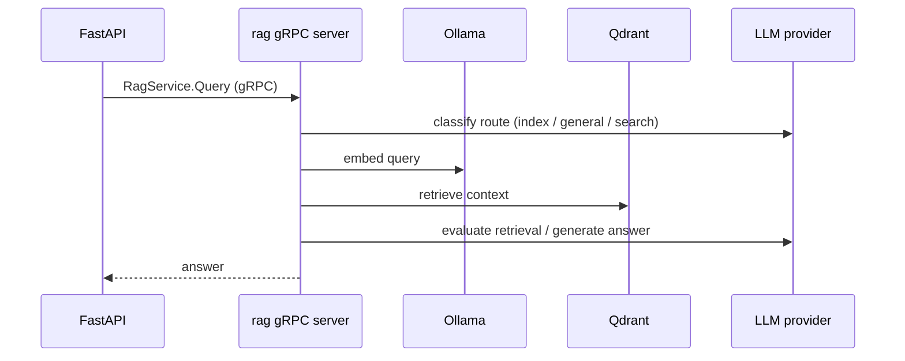

# ragify-rag

RAG engine for Ragify, exposed as a standalone gRPC server. It handles document ingestion (chunking, markdown conversion, PDF parsing via Grobid), embeddings (Ollama), vector storage (Qdrant) and the LangGraph query pipeline (routing, retrieval, evaluation, generation).

## Stack

- Python 3.12, gRPC (`grpcio`)
- LangChain, LangGraph, LangChain Qdrant/Ollama
- Qdrant client, Ollama client, Tavily (web search)
- Grobid client + grobid2json (PDF parsing)

## Layout

```text
src/
  core/
    classification/   query routing
    evaluation/       retrieval evaluator
    generation/       LangGraph graph, agent, prompts, state
    ingestion/        chunking, markdown conversion, PDF ingestion
    pipeline/         end-to-end pipeline
    reranking/        rerankers
    retrieval/        embedder, retriever, Qdrant vector store
    utils/            config, logger
  grpc/
    ragify.proto      shared contract
    server.py         gRPC server (three services)
```

## gRPC services

| Service | Methods | Backing modules |
| --- | --- | --- |
| `VectorStoreService` | `CreateCollection`, `DeleteCollection`, `InsertDocuments` | `src.core.retrieval` |
| `IngestionService` | `ProcessSection`, `ConvertToMarkdown`, `ProcessDocument`, `IngestPdf` | `src.core.ingestion` |
| `RagService` | `Query` | `src.core.generation` |

The proto lives at `src/grpc/ragify.proto`; a copy of the generated stubs is kept in `api-python/src/ragify_client/protos/`. Regenerate both with `make grpc-gen` from the repo root.

## Run

```bash
uv sync
.venv/bin/python -m src.grpc
```

or `make ragify-server` from the repo root. Default bind: `0.0.0.0:50051` (`RAGIFY_GRPC_HOST` / `RAGIFY_GRPC_PORT`).

### Prerequisites

- Qdrant running at `VECTORDB_URL` (default `http://localhost:6333/`)
- Ollama running with the embedding model (`EMBED_MODEL`, default `qllama/bge-small-en-v1.5:latest`)
- Grobid at `:8070` for PDF ingestion
- An OpenAI-compatible LLM endpoint (`LLM_URL` / `LLM_MODEL` / `LLM_API_KEY`) and, optionally, classification + Tavily keys

All config is read from the root `.env` via `src/core/utils/config.py`.

## Document ingestion flow



## Query flow



## Benchmark

`rag/benchmark/` evaluates retrieval and generation quality on a 45-query
ground-truth set over ~50 arXiv papers. Run it from `rag/benchmark` (requires
Qdrant with the `benchmark` collection populated, Ollama for embeddings, and the
configured LLM for generation + faithfulness judging):

```bash
cd rag/benchmark
../.venv/bin/python main.py
```

Results are persisted to `rag/benchmark/results/` (per-experiment JSON,
`latest.json`, `SUMMARY.md`).

Latest results (top_k=5, 45 queries, embeddings: `qllama/bge-small-en-v1.5`,
generation/judge: configured production LLM):

| Metric | Baseline | With reranker (bge-reranker-v2-m3) | Delta |
| --- | ---: | ---: | ---: |
| Doc Recall@5 | 0.8667 | 0.7778 | -0.0889 |
| MRR@5 | 0.7878 | 0.7667 | -0.0211 |
| NDCG@5 | 0.8069 | 0.7696 | -0.0373 |
| Chunk Relevance@5 | 0.8711 | 0.9333 | +0.0622 |
| Answer Fidelity | 0.6476 | 0.6713 | +0.0237 |
| Faithfulness (LLM judge) | 1.0000 | 0.9778 | -0.0222 |
| Avg Retrieval (ms) | 99.3 | 112.1 | +12.8 |
| Avg Rerank (ms) | - | 47152.1 | - |
| Avg Latency (ms) | 99.3 | 47264.1 | +47164.9 |
| p95 Latency (ms) | 140.0 | 67207.0 | +67067.0 |

Notes:

- The cross-encoder reranker improves chunk-level relevance (+6.2pp) and answer
  fidelity (+2.4pp), but lowers doc-level recall (-8.9pp) and costs ~47 s/query
  with the local transformers backend — not production-viable in this
  configuration. Retrieval-only answers run at ~99 ms avg / 140 ms p95.
- Faithfulness is LLM-judged with the `verify_prompt`; answers are generated
  strictly from retrieved context.

## Configuration

Key variables (see repo root `.env.example`): `VECTORDB_URL`, `EMBED_MODEL`, `VECTOR_SIZE`, `MAX_TOKENS`, `OVERLAP`, `LLM_URL`, `LLM_MODEL`, `LLM_API_KEY`, `LLM_STRUCTURED_OUTPUT`, `CLASSIFICATION_URL`, `CLASSIFICATION_MODEL`, `CLASSIFICATION_API_KEY`, `TAVILY_API_KEY`, `RAGIFY_GRPC_HOST`, `RAGIFY_GRPC_PORT`, `RAGIFY_GRPC_MAX_WORKERS`.

## Development

```bash
uv pip install -e .      # installs the ragify-server console script
python -m grpc_tools.protoc -I src/grpc ...   # or make grpc-gen
```
